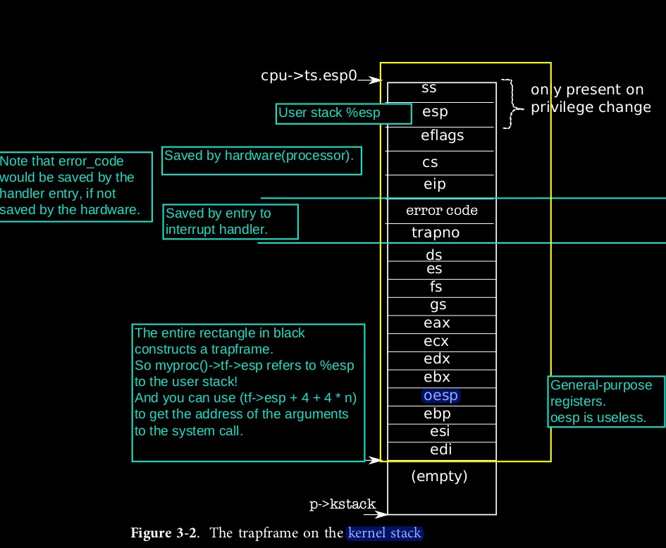

# Chapter 3

Three main challenges: (1) switch between user mode and kernel mode; (2) concurrency; (3) the kernel must understand the interfaces of the devices. 

### System calls, exception, and interrupts

Three cases when control passed to kernel: system call, exception, interrupt. When this happens, the system should save registers, raise to kernel mode, chose a place in kernel to execute, and should be able to get information about the event (like syscall args).

On the x86, syscall is generated by generating an interrupt with `int`, and excpetions generate interrupts. Thus, once the OS can handle interrupts, it can handle syscalls and exceptions.

### x86 protection

Lowest 2 bits of %cr0: 0 for kernel mode, 3 for user mode. Aka CPL.

Interrupt handlers are defined in the *interrupt descriptor table* (IDT). IDT has 256 entries, each giving %cs and %eip for handling the interrupt.

To make a syscall, use `int n` instruction. The `int` instruction does:

- Fetch the n-th descriptor from IDT.
- Check CPL <= DPL, where DPL is the privilege level in the descriptor.
- If TSS's PL < CPL, save %esp and %ss in CPU-internal registers, and load %ss and %esp from a task segment descriptor.
- Push %ss, %esp, if there's a privilege level change.
- Push %eflags, %cs, %eip.
- If this's an interrupt, clear the IF bit in the %eflags.
- Set %cs and %eip to values in the descriptor.

Load  %ss and %esp from task segment descriptor effectively uses the stack specified in the task segment, instead of the user stack, which might be corrupted.

Note that %ss and %esp are only pushed if there's a privilege level change. The `iret` instruction can be used to return from an `int`. It pops saved values and resumes execution at the saved %eip.

### Code: the first system call

For `initcode.S`, need to ensure that: `int` traps into kernel mode, the right kernel function is invoked, and the kernel can get syscall args.

### Code: Assembly trap handler

0-31: software interrupt; 32-63: hardware interrupt; 64: syscall interrupt.

`tvinit` handles system call specially.

User stack shouldn't be used when trapping into the kernel. X86 sets up a *task segment descriptor* through which the hardware loads a stack segment selector and a new value for %esp.

When a trap occurs, the hardware does the following. If we're originally in user mode, it loads %esp and %ss from the task segment descriptor, and pushes old user %ss and %esp onto the new stack. If originally in kernel mode, none of the above happens. Then %eflags, %cs, %eip are pushed. For some traps, an error word is pushed. Then %eip and %cs are loaded from relevant IDT entry. 

xv6 uses `vector.pl` to generate entry points that the IDT entries point to. Each entry pushes an error code if the processor didn't, pushes the interrupt number, and jumps to `alltraps` in `trapasm.S`.

So the entire execution flow of an system call:

```
	int n
-> 	hardware: loads new %esp and %ss, pushes old %ss and %esp,
	pushes %eflags, %cs, %eip, an error word, load %esp and %cs from IDT
-> 	vector entry: pushes interrupt number, jumps to alltraps
-> 	alltraps: pushes registers to form a `struct trapframe`,
	pushes %esp as arg and call `trap`
-> 	`trap` returns, pops arg, restore registers and `iret` to user mode
```



### Code: C trap handler

`Trap` uses `tf->trapno` to determine the trap No. If the trap is `T_SYSCALL`, then `syscall` is invoked. Then `trap` checks for hardware interrupt. If the interrupt is not a system call nor a hardware interrupt, xv6 assumes it to be illegal behavior.

### Code: System calls

`syscall` uses `tf->eax` as the syscall number (this matches `initCode.S`). `syscall` saves return value of the syscall in %eax, which is delivered to user code when the `tf` is restored by `trapret`. 

Note that arguments to syscalls are pushed in user mode and thus on user stack. So use `tf->esp` to locate the arguments. Precisely, `tf->esp` points to the return address for the syscall, so the n-th argument is at `tf->esp + 4 + 4 * n`.

### Code: interrupt

Interrupt handling shares code for syscalls and exceptions.

Multi-processors OS ignores PIC, but configures IOAPIC and local APIC.

A processor can control if it wants to receive interrupt through the IF flag in %eflags register. The instruction `cli` disables interrupts by clearing the IF flag, and `sti` enables the interrupt. 

Similar to syscall and exceptions, a trapframe is built on the kernel stack when an interrupt happens.

### Drivers

Skip for now.

