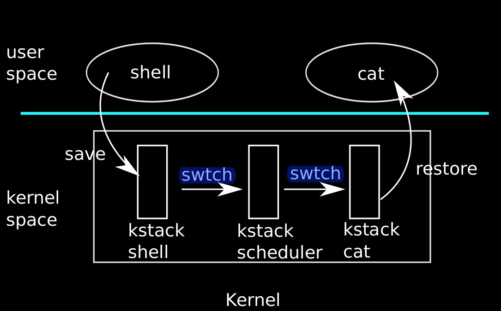

# Chapter 5 - Scheduling

## Multiplexing

Xv6 switches processes on the processor in two cases. First, xv6's `sleep` and `wakeup` switches when a process waits (for I/O, for a child to exit, or sleeps). Second, xv6 periodically forces a switch when a proces is executing user instructions. 

The challenges are: (1) how to switch? (2) How to switch transparently? (3) How to avoid race conditions? (4) A process's resources should be freed when it exits, then it cannot do this by itself since, for example, it cannot free its own kernel stack. (5) For multi-core machines, each core must remember which process it was executing so that system calls affect the correct process's kernel stack.


## Code: Context switching



Steps involved in a switch from one user process to another:

- Trap (syscall/interrupt) into old process's kernel thread
- context switch to current CPU's scheduler thread
- context switch to the new process's kernel thread
- trap return to the new process's user thread

Xv6 needs scheduler thread since it's sometimes unsafe to execute on any process's kernel stack. Let's examine switch between kernel thread and the scheduler thread.

Switching from one thread to another involves saving current thread's CPU registers, and restoring the new thread's CPU registers. Saving and restoring %esp and %eip causes change of stack and the executed code.

`swtch.S:swtch` performs the saves and restores. When it's time for a process to give up the CPU, the processor's kernel thread calls `swtch` to save its context, `struct context*`,  and return to the scheduler thread. `swtch` takes two arguments: `struct context **old` and `struct context *new`. It pushes current registers onto the stack and saves the stack pointer in `*old`. The `swtch` copies `new` into %esp, pops saved registers, and returns.

Consider `yield`. `yield` calls `sched`, which calls `swtch(&p->context, mycpu()->scheduler);` to switch to the scheduler's thread.

```assembly
.globl swtch
swtch:
  # Copy args into %eax, %edx
  movl 4(%esp), %eax # p->context
  movl 8(%esp), %edx # &(c->scheduler)

  # Save old callee-saved registers
  pushl %ebp
  pushl %ebx
  pushl %esi
  pushl %edi

  # Switch stacks
  movl %esp, (%eax) # *(p->context) = %esp
  movl %edx, %esp   # %esp = &(c->scheduler)

  # Load new callee-saved registers
  popl %edi
  popl %esi
  popl %ebx
  popl %ebp
  ret # Return to forkret
```

`swtch` first copies arguments from stack, before changing the stack pointer. The it pushes a `struct context` onto the current stack. Only the callee-saved registers are saved: %ebp, %ebx, %esi, %edi, %esp. The first four are saved explicitly. %esp is saved implicity by writing it to `*old`. Also,, %eip has been pushed onto the stack earlier, by the `call` instruction that invoked `swtch`. Now all registers are saved.

Then, `swtch` moves the pointer to the new context into %esp, and restores saved registers. In our example  `swtch(&p->context, mycpu()->scheduler);`, `swtch` switches to `cpu->scheduler`, the per-CPU scheduler context. That context was saved previously by the scheduler's `swtch`. 

Note that this `swtch` call in `sched` returns not to `sched`, but to `scheduler`. 


## Code: Scheduling

Given `swtch`, consider how to switch from one process to another. A process that wants to give up the CPU must acquire `ptable.lock`, release any other locks, update its own state `proc->state`, and calls `sched`. `Sched` knows a lock is held when it's called, so it knows interrupts are disabled. `Sched` calls `swtch` to save the curent context in `proc->context` and swtch to the scheduler's context. `swtch` returns on the scheduler's stack as though `scheduler`'s `swtch` has returned. The scheduler continues the for loop, finds another process's to run, switches to it, and the cycle repeats.

We saw that xv6 holds `ptable.lock` across calls to `swtch`. So `ptable.lock` is acquired in one thread but released in another. This's necessary for contexting swtiching to protect the invariants on the process's `state` and `context` that're not true while executing `swtch`.

A kernel thread always gives up the processor in `sched` and switches to some fixed location in the scheduler thread, and then switches to some kernel thread that previously called `sched`. 

`scheduler` holds `ptable.lock` most of the time, but releases the lock and explicitly enables interrupts once in each iteration of the outer loop. This is important for the special case when the CPU is idle and there's no `RUNNABLE` process. If an idling scheduler looped with the lock continuously held, no other non-idle CPU could perform a context switch (as that requires acquiring the lock). The reason to enable interrupt periodically on the idling CPU is that there might be no `RUNNABLE` processes because all processes are waiting for I/O. If the scheduler never enables interrupt, the I/O never arrives.

Once scheduler finds a `RUNNABLE` process, it sets per-CPU variable `proc`, switches page table with `switchuvm`, marks the process as `RUNNING`, and calls `swtch`. 

**Reflection**: One way to think about the structure of the scheduling code, and particular holding `ptable.lock` across threads, is to enforce certain invariants about each process, and holding `ptable.lock` whenever those invariants aren't true. One invariant is that when a process is `RUNNING`, the CPU registers should hold the process's register values, %cr3 must hold the process's page table, %esp must refer to the process's kernel stack. Maintaing the invariants is the reason why xv6 holds lock across different threads. 


## Code: mycpu and myproc

Requires disabling interrupts. Read the book for explanation.


## Sleep and wakeup

Scheduling and locks conceal the existence of one process from another, while sleep and wakeup help processes interact. 

Busy waiting producer-consumer:

```c
struct q {
    void *ptr;
};

void *
send(struct q *q, void *p) {
    while (q->ptr != 0)
        ;
    q->ptr = p;
}

void *
recv(struct q *q) {
    void *p;
    while ((p = q->ptr) == 0)
        ;
    q->ptr = 0;
    return p;
}
```

Sleep & wakeup producer-consumer

```c
struct q {
    void *ptr;
};

void *
send(struct q *q, void *p) {
    while (q->ptr != 0)
        ;
    q->ptr = p;
    wakeup(q); /* wake recv */
}
void *
recv(struct q *q) {
    void *p;
    while ((p = q->ptr) == 0) // (*)
        sleep(q);			  // (**)
    q->ptr = 0;
    return p;
}
```

However, the "lost wake-up" problem is hard to avoid, which causes the program to hang in this example. Suppose `recv` executes (*) and finds that `q->ptr == 0`. Suppose before it executes (**), `send` executes `q->ptr = p` and calls `wakeup`, which finds no processes sleeping and does nothing. Now `recv` continues executing and goes to sleep. The program hangs.

The problem here is that the invariant that `recv` only sleeps when `q->ptr == 0` is violated. An incorrect fix:

```c
struct q {
    struct spinlock lock;
    void *ptr;
};
void *
send(struct q *q, void *p) {
    acquire(&q->lock);
    while (q->ptr != 0)
        ;
    q->ptr = p;
    wakeup(q);
    release(&q->lock);
}
void *
recv(struct q *q) {
    void *p;
    acquire(&q->lock);
    while ((p = q->ptr) == 0)
        sleep(q);
    q->ptr = 0;
    release(&q->lock);
    return p;
}
```

The problem is that `recv` sleeps while holding the lock, causing deadlock.

We fix by changing the interface of `sleep`: the caller must pass the lock to `sleep` so it can release the lock after the calling process is marked as asleep and waiting on the sleep channel. The lock would force a concurrent `send` to wait until the receiver has finished putting itself to sleep, so that the `wakeup` wouldn't be lost. The right way:

```c
struct q {
    struct spinlock lock;
    void *ptr;
};
void *
send(struct q *q, void *p) {
    acquire(&q->lock);
    while (q->ptr != 0)
        ;
    q->ptr = p;
    wakeup(q);
    release(&q->lock);
}
void *
recv(struct q *q) {
    void *p;
    acquire(&q->lock);
    while ((p = q->ptr) == 0)
        sleep(q, &q->lock);
    q->ptr = 0;
    release(&q->lock);
    return p;
}
```

The fact that recv holds `q->lock` prevents `send` from trying to wake it up between `recv`’s check of `q->ptr` and its call to `sleep`.

The xv6's implementation of ` sleep` and `wake` follow the above-mentioned interface. 


## Code: sleep and wakeup

Basic idea: `sleep` marks the current process as `SLEEPING` and call `sched` to release the processor; `wakeup` looks for a process waiting on the given channel and marks it as `RUNNABLE`.

`sleep` first acquires `ptable.lock`. Now the process holds `ptable.lock` and `lk` . Holding `lk` **was** necessary, to ensure no other processes cannot call `wakeup` before it sleeps. Now that it holds `ptable.lock`, it's safe to release `lk`. Some other processes might try to call `wakeup`, but `wakeup` requires acquiring `ptable.lock`. So the "lost-wakeup" is avoided.

Now `sleep` holds `ptable.lock` and no other locks, it can put the process to sleep: record sleep channel, change proces state, and calls `sched`. 

Some time later, a process calls `wakeup(chan)`. `Wakeup` acquires `ptable.lock` and calls `wakeup1` which does the real work. `Wakeup1` searches the process table for `SLEEPING` processes with the given `chan`, and changes the state to `RUNNABLE`. The next time the seheduler runs, the process(es) is ready to run.

The `sleep` should be called inside a loop to handle possible spurious wakeups.

It's ok if multiple uses of sleep/wakeup uses the same channel: they would experience spurious wakeups, but looping tolerate this problem.


>  Question: `sleep` puts the current process to sleep whlie holding `ptable.lock`, wouldn't that prevent other proceses from acquiring the lock? Many functions like `exit`, `wait` requies acquiring `ptable.lock`. 

Answer: Yes. Indeed `sleep` puts the process to sleep with `ptable.lcok` held. However, notice that `sleep` calls `sched` to goes to sleep, and the only other call to `sched` are In `yield`, where `sched` is immediately followed by the release of `ptable.lock`. As we know, `sched` causes return in another process. In other words, the `sched` call in `sleep` causes return of `sched` in `yield`, and the release of `ptable.lock`. So this's not a problem and indeed `ptable.lock` would be released when the process goes to sleep.


## Code: pipes

In xv6, pipes are implemented using `sleep` and `wakeup`.

The pipe code uses separate sleep channels for reader and writer (`p->nread` and `p->nwrite`), to make the system more efficient when there're many readers and writers. 


## Code: wait, exit, and kill

The `wait` system call allows a parent process to wait for a child to exit. When a child exits, it does not die immediately. Instead, it switches to the `ZOMBIE` process state until the parent calls `wait` to learn of the exit. The parent is then responsible for freeing the memory associated with the process and preparing the `struct proc` for reuse. If the parent exits before the child, the `init` process adopts the child and waits for it, so that every child has a parent to clean up after it.

The implementation challenge is the possible races between parent and child `wait` and `exit`, as well as `exit` and `exit`. `Wait` begins by acquiring `ptable.clock`. If the current process has children but none has exited, it calls `sleep`  and would releases `ptable.lock`. This's a special case: previously when we're switching between processes, we always holds the `ptable.lock` during the transitioning.

The child process can do most of the clearnup in `exit`, but only the parent process can free `p->kstack` and `p->pgdir`, as the child process's call to `exit` stills requires the stack and the paging. 

`kill` lets one process to request another to be terminated. It'll be complex for `kill` to destory the victim process as it might be executing on another CPU, or sleeping while midway throught update some kernel data structure. Thus, `kill` does very little: sets the victime's `p->killed` and if it's sleeping, wakes it up. Eventually the victim would enter/leave the kernel, and the code in `trap` would call `exit` if `p->killed` is set. 

If the victim process is in `sleep`, the call of `wakeup` causes spurious wakeup. However, this's not a problem as xv6 always wraps calls to `sleep` in `while` loop. 


 

##### 