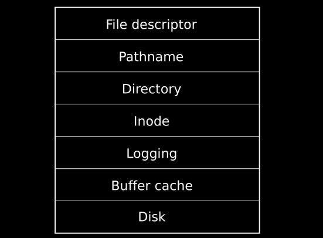
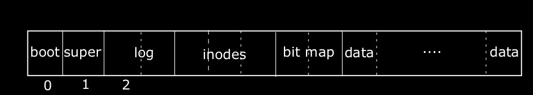

# Chapter 6 - File System

- Challenges
  - On-disk data structure is needed to represent files and directories.
  - Crash recovery.
  - Different processes could operate on the same file system at the same time. So concurrency control is needed.
  - Accessing disk is expensive. In-memory cache should be maintained for better performance. 

## Overview

Seven-layer model in xv6.



```
File descriptor	Abstract Unix resources using the file system interface
Pathname		Provide hierarchical path names
Directory		Represent directory
Inode			Represent individual files
Logging			Provide the abstraction of atomicity and transaction
Buffer cache	Cache disk blocks and synchronizes disk access from kernel
Disk			Read/write blocks on IDE hard disk.
```



The disk is divided into sections/blocks by xv6. Block 0 is not used by the file system, but holds the bootloader. Block 1 is the *superblock*, containing metadata of the file system. Then we have blocks for log, inodes, bitmap, data.  

## Buffer cache layer

Code in `bio.c`. Two jobs: (1) synchronize access to disk blocks to ensure that only one copy of a block is in memory and that only one kernel thread at a time uses that copy; (2) cache popular blocks in memory to avoid disk access.

`bread` returns a buffer containing a copy of a block, which can be read/modifed in meomry. `bwrite` writes a modified buffer to the block on disk. A kernel thread must calls `brelse` when it's done with a buffer. The buffer cache uses a per-buffer sleep-lock to avoid race. `bread` acquires the lock, and `brelse` releases the lock.

## Code: Buffer cache

It is safe for `bget` to acquire the buffer’s sleep-lock outside of the `bcache.lock` critical section, since the non-zero `b->refcnt` prevents the buffer from being re-used for a different disk block. The sleep-lock protects reads and writes of the block’s buffered content, while the `bcache.lock` protects information about which blocks are cached.

Once `bread` has read the disk (if needed) and returned the buffer to its caller, the caller has exclusive use of the buffer and can read or write the data bytes. If the caller does modify the buffer, it must call `bwrite` to write the changed data to disk before releasing the buffer.

`Brelse` releases the sleep-lock and moves the buffer to the front of the linked list. Moving the buffer causes the list to be ordered by how recently the buffers were released. `bcache.head.next` is the least recently released buffer.

## Logging Layer

Designed to provide crash recovery. An system call doesn't write to the on-disk file system data structures directly. Instead, it does the following:

1. Place a description of all disk writes it wants to do in a *log* on the disk;
2. Once all writes are logged, writes a *commit* record to the disk;
3. Writes to the on-disk data structures;
4. After all writes complete, erases the log. 

If the system crashes and reboots, the system recovers as follows. If the log is marked as committed, then writes to the on-disk data structures following the log. If the log is not committed, then ignore the log. The recovery mode finishes when all logs are erased. This logging scheme ensures the atomicity of disk writes.

## Log Design

The logs are stored in the superblock. It consisits of a head block, followed by several of logged blocks. The header block contains an array of sector numbers (one for each logged blocks), and the count of log blocks. Xv6 writes the header block whenever a transaction commits.

Each system call indicates the range of writes that must be atomic. To allow concurrent exectuion, the system accumulates writes of multiple system calls into one transaction. This idea is called *group commit*.

Xv6 allocates a fixed amount of on-disk for logs. The total number of blocks written by the syscalls must fit in that space. 

## Code: logging

Typical code snippet to use log, or transaction, in a system call:

```c
begin_op();
...
bp = bread(...);
bp->data[...] = ...;
log_write(bp);
...
end_op();
```

Read the section and comments in `log.c`.

## Code: Block allocator

`balloc` and `bfree`.

## Inode layer

The term *inode* can have two meanings: (1) on-disk data structure containing a file's size and list of data blocks, or (2) in-memory inode, which's a copy of the on-disk data structure as well as extra information needed by the kernel.

On-disk inodes are packed into the inode blocks on the disk. Each inode is of fixed-size, so it's easy to index into the inode blocks. Each inode has a number, called i-number, as the identifier. Note that i-number is unique only within the same device.

On-disk inode: `sturct dinode`. In-memory inode: `struct inode`. The kernel stores an `inode` in memory only if there're C pointers referring to that inode, and the kernel discards the inode from memory if the reference count drops to zero. The `iget` and `iput` functions acquire and release pointer to an inode, changing the reference count. 

Four lock-like mechanism's in xv6's inode code:

1. `icache.lock` protects the invariant that an inode is present in the cache at most once, and the invariant that a cached inode's `ref` fields counts the number of in-memory C pointers to the cached inode. 
2. Each in-memory inode has a `lock` field containing a sleep-lock to ensure exlucsive access to the inode's fields as well as the inode's content block.
3. The file system maintains the inode in cache if the inode's `ref` is greater than zero.
4. Each inode contains a `nlink` field that counts the number of directories that refer to the file. Xv6 won't free the inode if its link count is greater than zero.

A `struct inode` pointer returned by `iget()` is guaranteed to be valid unitl the corresponding call to `iput()`, because it increments the `ref` field. `iget()` provides non-exclusive access to the inode, so that there can be multiple pointers to the same inode.

The `struct inode` returned by `iget` may not have any useful content. To ensure that it holds a copy of the on-disk inode, code must call `ilock`. `Ilock` locks the inode and reads the inode from the disk. Separating acquisition of inode pointers from locking helps avoid deadlock in some situations. 

The main job of the inode cache is to synchronizing access by multiple processes, while caching is secondary.  

## Code: Inodes

`iput` may writes to the file. Thus, even calls like `read()` that appear to be read-only may write to the disk. So, even read-only system calls must be wrapped in transactions if they use the file system. 

[Difference between link count and reference count](https://unix.stackexchange.com/a/343282).

## Code: Inode content

Direct block and indirect block.

`bmap`, `readi` and `writei`.

## Code: Directory layer

`dirlookup` and `dirlink`.

## Code: Path names

`namei`, `nameiparent`, and `namex`.

## File descriptor layer

Xv6 gives each process its own table of file descroptors. Each open file is represented by a `struct file`, **a wrapper around either an inode or a pipe**, plus an I/O offset. On the other hand, a single open file can appear multiple times in one process's file table and also in the file tables of multiple processes. 

All open files in the system are kept in a global file descriptor table, `ftable`, which provides `filealloc`, `filedup`, `fileclose`, `fileread`, `filewrite`.

## Code: system calls

With the functions that the lower layers provide the implementation of most system calls is trivial (see `sysfile.c`).

`sys_link`, `sys_unlink` and `create`.